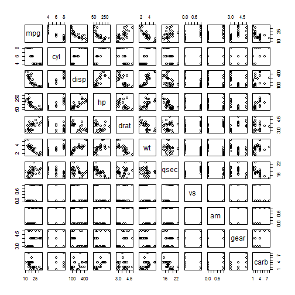
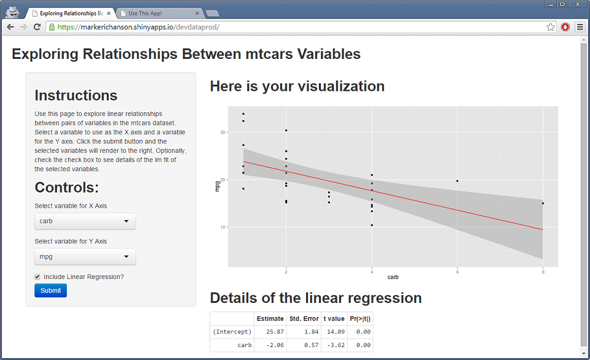

---
title       : Use This App!
subtitle    : or, here is my data products project
author      : Mark Hanson
job         : 
framework   : io2012        # {io2012, html5slides, shower, dzslides, ...}
highlighter : highlight.js  # {highlight.js, prettify, highlight}
hitheme     : tomorrow      # 
widgets     : []            # {mathjax, quiz, bootstrap}
mode        : selfcontained # {standalone, draft}
knit        : slidify::knit2slides

--- .class #id 

## The Data: mtcars

The data was extracted from the 1974 Motor Trend US magazine, and comprises fuel consumption and 10 aspects of automobile design and performance for 32 automobiles (1973-74 models).

A data frame with 32 observations on 11 variables.
```
[, 1]   mpg	 Miles/(US) gallon
[, 2]	 cyl	 Number of cylinders
[, 3]	 disp	 Displacement (cu.in.)
[, 4]	 hp	 Gross horsepower
[, 5]	 drat	 Rear axle ratio
[, 6]	 wt	 Weight (lb/1000)
[, 7]	 qsec	 1/4 mile time
[, 8]	 vs	 V/S
[, 9]	 am	 Transmission (0 = automatic, 1 = manual)
[,10]	 gear	 Number of forward gears
[,11]	 carb	 Number of carburetors
```

--- &twocol

## The Problem: Exploring (Potential) Linear Relationships
*** {name: left}

We want an easy way to look at pairwise relationships, with or without a linear regression.
We don't want to build something like pairs (to the right) to do this, but instead somethign dynamic.
*** {name: right}
 


--- &twocol

## The Approach: Shiny App With ggplot2 Rendering
(Note: div/border mismatch below appears to be a slidify  bug.) Here are snippets of the actual code which can be found at https://github.com/markerichanson/devdataprod_shiny.
*** {name: left}
# ui.R

```r
t<-seq_along(mtcars)
names(t)<-names(mtcars)
shinyUI(
  fluidPage(
    # Application title
    titlePanel("Exploring Relationships Between mtcars Variables"),
    sidebarPanel(
      h2('Instructions'),
      div(HTML(
        "Use this page to explore linear relationships between pairs of variables in the mtcars dataset.
        Select a variable to use as the X axis and a variable for the Y axis.  Click the submit button and the selected variables will render to the right.
        Optionally, check the check box to see details of the lm fit of the selected variables."
        )),
      h2('Controls:'),
```
*** {name: right}
# server.R

```r
require(ggplot2)
require(xtable)

data(mtcars)

shinyServer(
  function(input, output) {
     
     output$xAxis <- renderPrint(names(mtcars)[[{as.numeric(input$xAxis)}]])
     output$yAxis <- renderPrint(names(mtcars)[[as.numeric(input$yAxis)]])
     output$includeRegression <- renderPrint({input$includeRegression})

     output$plot<-renderPlot({
       .e <- environment()
```

--- .class #id

## Example



